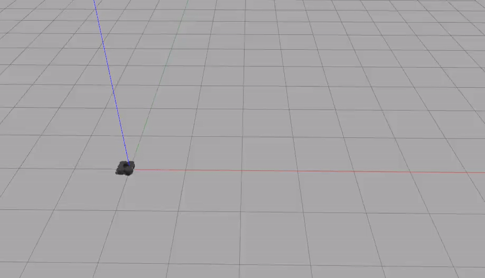

# warmup_project

## Drive in a Square

The goal here is just to get a robot to
drive in a square. I achieved this by having
the robot perform a sequence of moves with 
set velocities and durations.

I have a class called MoveState that represents
a preset movement with forward velocity, angular
velocity, and duration. I also created a SquareDriver
class that controls the robot. SquareDriver.set_velocity
sets the velocity via the `/cmd_vel` channel. SquareDriver.run
loops through the list of MoveStates and sets the velocity
accordingly.

(the robot starts moving a bit late in the recording)

## Person Follower

The goal here is to have to the robot follower 
a person/cylinder. I achieved this by reading in the 
LIDAR scan data, and using proportional control to 
have the robot both turn towards the person,
and drive towards them as well.

I have a PersonFollower class that encapsulates
all of my logic. The set_velocity function just sends
a message on `/cmd_vel` to set the velocity. The run
function starts the subscriber. process_scan is the 
callback to the subscriber; this function reads 
scan data and uses proportional control to steer
the robot towards the person. I also added a few conditionals
so the robot would only drive forward if it was
roughly pointing at the person, and so that it wouldn't 
continue to jiggle after it was pointed towards the person.

# TODO rewrite this part for all parts

The biggest challenge was getting the movements 
to be consistent. As I was tuning the velocities/durations,
I would encounter issues where the first two turns worked
fine, but the third was way off. Eventually, through some
trial-and-error, I got the turns well tuned.

In the future, I would like to improve this by using some
sort of sensor to determine how far the robot had moved/turned.
The friction from the movements means that the movements
can be off and the robot won't know, and just keep going off
in the wrong direction. Using some sort of sensor would help
the robot follow its path more robustly.

Takeaways:
1. Friction is very annoying. Sometimes the robot would just not turn enough, and then veer way off course. Relying on more robust methods than timing seems to be the way to go.
2. Make sure to use rospy.sleep well. Originally, I was running a loop 100 times a second and updating the speed through that. But by instead just sleeping for the duration of the movement, my controller became more accurate and simpler to maintain.
